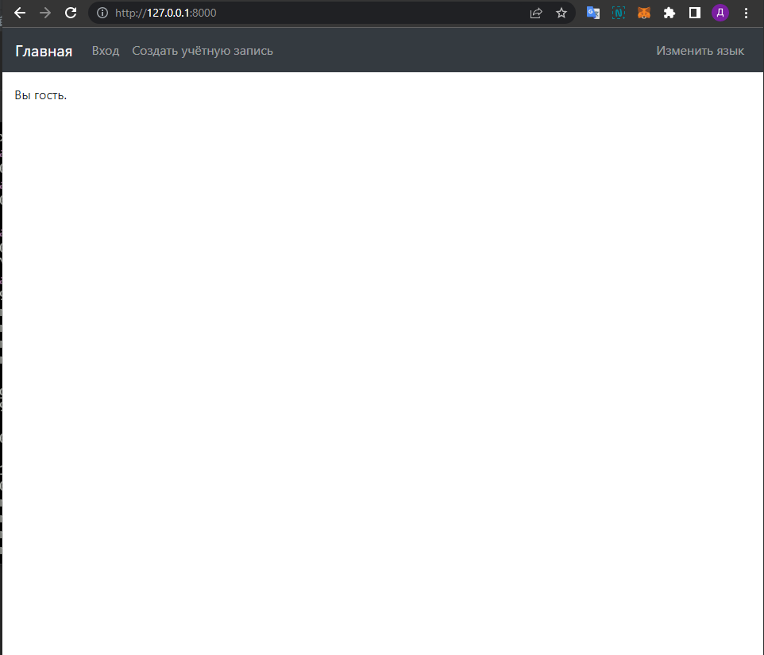
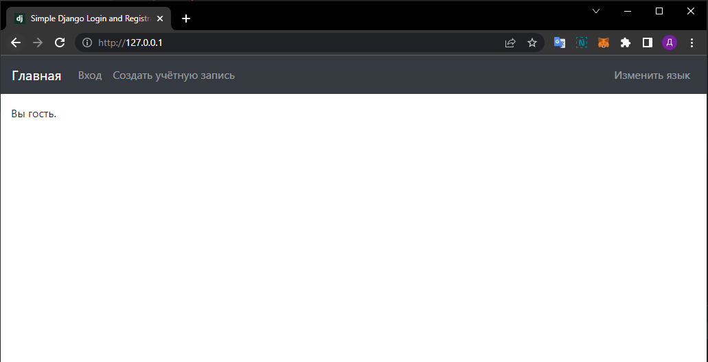

#  Отчёт
1. [Поиск подходящего проекта](#1)
2. [Настройка nginx](#2)
3. [Настройка `docker-compose.yml`](#3)
4. [Запуск](#4)


## [Поиск подходящего проекта](#1)    
За основу был взят проект [simple-django-login-and-register](https://github.com/egorsmkv/simple-django-login-and-register)

Вместо Poetry было использовано обычное создание виртуального окружения и установка зависимостей из файла requirements.txt

### Проверка на работоспособность:
```bash
pip install -r requirements.txt
python manage.py migrate
python manage.py runserver
```



## [Настройка nginx](#2)
- Пропишем в `local.conf` конфиг для подключения Django
- Добавим `local.conf` в `/etc/nginx/conf-d/` контейнера nginx

## Настройка `docker-compose.yml`
- Добавим сервис `web` для Django, который будет слушать 8000 порт окружения
- Добавим сервис `nginx` для nginx, который будет слушать 80 порт системы

## Запуск
```bash
docker-compose build
docker-compose up -d
```

```bash
mrbgn@DESKTOP-P93RVG9:~/Documents/sit$ docker-compose up -d
Creating sit_web_1         ... done
Creating sit_nginx_1       ... done
```


